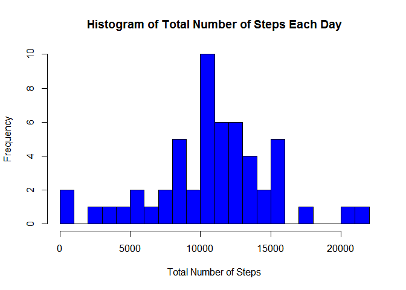
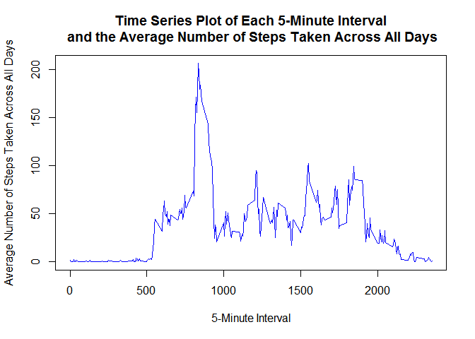
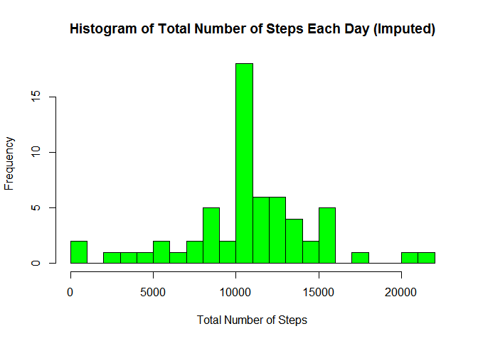
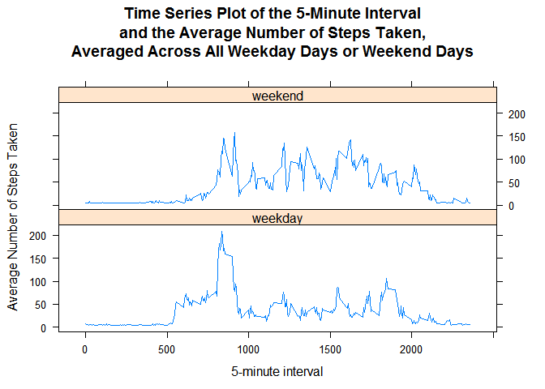

# Reproducible Research: Peer Assessment 1
# Introduction
This assignment makes use of data from a personal activity monitoring device. This device collects data at 5 minute intervals through out the day. The data consists of two months of data from an anonymous individual collected during the months of October and November, 2012 and include the number of steps taken in 5 minute intervals each day.

# Data
The data for this assignment can be downloaded from the course web site:   
- Dataset: [Activity monitoring data](https://d396qusza40orc.cloudfront.net/repdata%2Fdata%2Factivity.zip) [52K]

The variables included in this dataset are:  
- steps: Number of steps taking in a 5-minute interval (missing values are coded as NA)  
- date: The date on which the measurement was taken in YYYY-MM-DD format  
- interval: Identifier for the 5-minute interval in which measurement was taken  

The dataset is stored in a comma-separated-value (CSV) file and there are a total of 17,568 observations in this dataset.


#Preparation Steps
##Install Pre-requisites
First install packages required to process the data.
1. dplyr is used for structuring the data for analysis
2. ggplot2 is used for plotting
3. Hmisc is used for imputation
4. lattice is used for time series plot

```r
library(dplyr)
```

```
## 
## Attaching package: 'dplyr'
```

```
## The following objects are masked from 'package:stats':
## 
##     filter, lag
```

```
## The following objects are masked from 'package:base':
## 
##     intersect, setdiff, setequal, union
```

```r
library(ggplot2)
library(lattice)
library(Hmisc)
```

```
## Loading required package: grid
```

```
## Loading required package: survival
```

```
## Loading required package: Formula
```

```
## 
## Attaching package: 'Hmisc'
```

```
## The following objects are masked from 'package:dplyr':
## 
##     combine, src, summarize
```

```
## The following objects are masked from 'package:base':
## 
##     format.pval, round.POSIXt, trunc.POSIXt, units
```

##Set working directory
Next, set the working directory to where the data should resides.

```r
setwd("~/Git/RepData_PeerAssessment1")
```

#Asisgnment Steps
##Loading and preprocessing the data
1. Load the data (i.e. read.csv())

```r
#### download zip file from website if not exists
if(!file.exists("./data")) {dir.create("./data")}
fileUrl <- "https://d396qusza40orc.cloudfront.net/repdata%2Fdata%2Factivity.zip"
destfilepath <- "./activity.zip"
if(!file.exists(destfilepath)) {
download.file(fileUrl,destfile = destfilepath)
}
        
#### unzip data
zipfile <- unzip(destfilepath, exdir = "./data")

#### load the data
activityData <- read.csv("./data/activity.csv")
```

2.Process/transform the data (if necessary) into a format suitable for your analysis
Here, we transform the date attribute to date format instead of factor.

```r
activityData$date <- as.Date(activityData$date, format = "%Y-%m-%d")
```

Let's check the data structure.

```r
str(activityData)
```

```
## 'data.frame':	17568 obs. of  3 variables:
##  $ steps   : int  NA NA NA NA NA NA NA NA NA NA ...
##  $ date    : Date, format: "2012-10-01" "2012-10-01" ...
##  $ interval: int  0 5 10 15 20 25 30 35 40 45 ...
```

## What is mean total number of steps taken per day?
For this part of the assignment, we can ignore the missing values in the dataset.

1.Calculate the total number of steps taken per day
First, Re-populating data frame that aggregate the sum of steps for each date.

```r
activityDataNoNA <- na.omit(activityData) 
activityStepsByDay <- aggregate(steps ~ date, activityDataNoNA, sum)
colnames(activityStepsByDay) <- c("date","totalSteps")
head(activityStepsByDay)
```

```
##         date totalSteps
## 1 2012-10-02        126
## 2 2012-10-03      11352
## 3 2012-10-04      12116
## 4 2012-10-05      13294
## 5 2012-10-06      15420
## 6 2012-10-07      11015
```

2.If you do not understand the difference between a histogram and a barplot, research the difference between them.  
To understand the difference, check on below:  
Histogram - Histograms use continuous data where the bins represent ranges of data rather than categories.  
barplot - Barplot need not be based on counts or frequencies. You can create bar plots that represent means, medians, standard deviations, etc.    

Next, Make a histogram of the total number of steps taken each day.  
This is done by plotting a histogram with y-axis as Frequency and x-axis as Total Number of Steps.  

```r
hist(activityStepsByDay$totalSteps, breaks = 25, xlab="Total Number of Steps", main = "Histogram of Total Number of Steps Each Day", col = "blue")
```

<!-- -->

3.Calculate and report the mean and median of the total number of steps taken per day  
Use the mean function below to calculate mean and ignore missing value.  

```r
TotalStepsByDayMean   <- mean(activityStepsByDay$totalSteps, na.rm=TRUE)
```
What is mean total number of steps taken per day?  
The mean total number of steps taken per day is 

```
## [1] 10766.19
```

Use the median function below to calculate median and ignore missing value.

```r
TotalStepsByDaymedian <- median(activityStepsByDay$totalSteps, na.rm=TRUE)
```
The median total number of steps taken per day is 

```
## [1] 10765
```

## What is the average daily activity pattern?
1.Make a time series plot (i.e. type = "l") of the 5-minute interval (x-axis) and the average number of steps taken, averaged across all days (y-axis)  
First, get the average number of steps by 5-minute interval across all days  

```r
activityStepsInterval <- aggregate(steps ~ interval, activityDataNoNA, mean)
colnames(activityStepsInterval) <- c("interval","meanSteps")
head(activityStepsInterval)
```

```
##   interval meanSteps
## 1        0 1.7169811
## 2        5 0.3396226
## 3       10 0.1320755
## 4       15 0.1509434
## 5       20 0.0754717
## 6       25 2.0943396
```

Next, make the time series plot  

```r
plot(x = activityStepsInterval$interval, y = activityStepsInterval$meanSteps,
        type = "l", col = "blue", 
        main = "Time Series Plot of Each 5-Minute Interval\n and the Average Number of Steps Taken Across All Days",
        xlab = "5-Minute Interval",
        ylab = "Average Number of Steps Taken Across All Days"
)
```

<!-- -->

2.Which 5-minute interval, on average across all the days in the dataset, contains the maximum number of steps?  
Use the which.max function below to locate the index of maximun number of steps.  

```r
maxAvgStepsIndex <- which.max(activityStepsInterval$meanSteps)
activityStepsInterval[maxAvgStepsIndex,]
```

```
##     interval meanSteps
## 104      835  206.1698
```
Get the 5-minute interval with maximum number of steps.

```r
activityStepsInterval[maxAvgStepsIndex,]$interval
```

```
## [1] 835
```

What is the average daily activity pattern?  
That individual have no or little movement before 500 minutes (between 12am ~ 5am).  
The individual activities is at it's peak at 835 minutes (around 8.30am).  

## Imputing missing values
Note that there are a number of days/intervals where there are missing values (coded as NA). The presence of missing days may introduce bias into some calculations or summaries of the data.

1.Calculate and report the total number of missing values in the dataset (i.e. the total number of rows with NAs)   

```r
totalRowOfMissingValue <- nrow(activityData[is.na(activityData$steps),])
```
The total number of missing values is 

```
## [1] 2304
```

2.Devise a strategy for filling in all of the missing values in the dataset. The strategy does not need to be sophisticated. For example, you could use the mean/median for that day, or the mean for that 5-minute interval, etc.  
For this, we will use the mean for the 5-minute interval across all days to fill in all the missing values.  
3.Create a new dataset that is equal to the original dataset but with the missing data filled in.  
We use impute function to fill NA data with mean (average) and check if all NAs rows was imputed

```r
activityDataImputed <- activityData
activityDataImputed$steps <- impute(activityData$steps, fun=mean)
totalRowOfNewDataFrame <- nrow(activityData[is.na(activityDataImputed$steps),])
totalRowOfNewDataFrame
```

```
## [1] 0
```
The new total number of row with missing values is 0 indicating all missing value was filled.  

4.Make a histogram of the total number of steps taken each day and Calculate and report the mean and median total number of steps taken per day. Do these values differ from the estimates from the first part of the assignment? What is the impact of imputing missing data on the estimates of the total daily number of steps?  
First, Re-populating data frame that aggregate the sum of steps for each date.  

```r
activityStepsByDayImputed <- aggregate(steps ~ date, activityDataImputed, sum)
colnames(activityStepsByDayImputed) <- c("date","totalSteps")
head(activityStepsByDayImputed)
```

```
##         date totalSteps
## 1 2012-10-01   10766.19
## 2 2012-10-02     126.00
## 3 2012-10-03   11352.00
## 4 2012-10-04   12116.00
## 5 2012-10-05   13294.00
## 6 2012-10-06   15420.00
```

Then, make a histogram of the total number of steps taken each day.     

```r
hist(activityStepsByDayImputed$totalSteps, breaks = 25, xlab="Total Number of Steps", 
     main = "Histogram of Total Number of Steps Each Day (Imputed)", col = "green")
```

<!-- -->

Calculate and report the mean and median of the total number of steps taken per day.  
Use the mean function below to calculate mean.

```r
TotalImputedStepsByDayMean   <- mean(activityStepsByDayImputed$totalSteps, na.rm=TRUE)
TotalImputedStepsByDayMean
```

```
## [1] 10766.19
```
Use the median function below to calculate median.

```r
TotalImputedStepsByDaymedian <- median(activityStepsByDayImputed$totalSteps, na.rm=TRUE)
TotalImputedStepsByDaymedian
```

```
## [1] 10766.19
```

We check the difference of Mean between data without missing value and data with imputed value.  
Data without missing value:

```
## [1] 10766.19
```
Data with imputed value:

```
## [1] 10766.19
```

Then, we check the difference of Median between data with without missing value and data with imputed value.  
Data without missing value:   

```
## [1] 10765
```
Data with imputed value:  

```
## [1] 10766.19
```
Do these values differ from the estimates from the first part of the assignment?  
There is no different between the Mean of the original and imputed value.  
There is a slight increase on the median for imputed value.  

What is the impact of imputing missing data on the estimates of the total daily number of steps?  
From the plot, there is an increase of frequency on the total number of steps range from 10000 to 11000.

## Are there differences in activity patterns between weekdays and weekends?  
For this part the weekdays() function may be of some help here. Use the dataset with the filled-in missing values for this part.  

1.Create a new factor variable in the dataset with two levels - "weekday" and "weekend" indicating whether a given date is a weekday or weekend day.  
Using the imputed data in previous step, create new 2 levels factor variable - daytype.  

```r
activityDataWEWD <- activityDataImputed
activityDataWEWD$daytype <- factor(weekdays(activityDataWEWD$date))
levels(activityDataWEWD$daytype)<-list(weekday = c("Monday", "Tuesday", "Wednesday", "Thursday", 
                                                "Friday")
                                    ,weekend = c("Saturday", "Sunday"))
```

Check the variable created:  

```r
str(activityDataWEWD)
```

```
## 'data.frame':	17568 obs. of  4 variables:
##  $ steps   :Class 'impute'  atomic [1:17568] 37.4 37.4 37.4 37.4 37.4 ...
##   .. ..- attr(*, "imputed")= int [1:2304] 1 2 3 4 5 6 7 8 9 10 ...
##  $ date    : Date, format: "2012-10-01" "2012-10-01" ...
##  $ interval: int  0 5 10 15 20 25 30 35 40 45 ...
##  $ daytype : Factor w/ 2 levels "weekday","weekend": 1 1 1 1 1 1 1 1 1 1 ...
```

```r
table(activityDataWEWD$daytype)
```

```
## 
## weekday weekend 
##   12960    4608
```

2.Make a panel plot containing a time series plot (i.e. type = "l") of the 5-minute interval (x-axis) and the average number of steps taken, averaged across all weekday days or weekend days (y-axis). See the README file in the GitHub repository to see an example of what this plot should look like using simulated data.  

Get the average of the interval across all weekday days & weekend days.  

```r
activityStepsIntervalWEWD <- aggregate(steps ~ interval + daytype, activityDataWEWD, mean)
colnames(activityStepsIntervalWEWD) <- c("interval","daytype", "meanSteps")
head(activityStepsIntervalWEWD)
```

```
##   interval daytype meanSteps
## 1        0 weekday  7.006569
## 2        5 weekday  5.384347
## 3       10 weekday  5.139902
## 4       15 weekday  5.162124
## 5       20 weekday  5.073235
## 6       25 weekday  6.295458
```

plot time series using lattice.  

```r
xyplot( meanSteps ~ interval | daytype,
        activityStepsIntervalWEWD,
        type = "l",
        layout = c(1,2),
        main = "Time Series Plot of the 5-Minute Interval\nand the Average Number of Steps Taken,\nAveraged Across All Weekday Days or Weekend Days",
        xlab = "5-minute interval",
        ylab = "Average Number of Steps Taken"
)
```

<!-- -->

Are there differences in activity patterns between weekdays and weekends?  
Yes, the plot shows that the individual have more movements over the weekend than weekday.  
